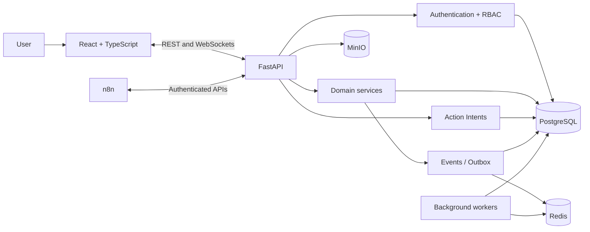

<div align="center">

# Portal Vesper

### A modular corporate operations, governance and automation platform

[](https://github.com/Mayconxzdev/Portal/actions/workflows/ci.yml)
[](https://github.com/Mayconxzdev/Portal/actions/workflows/codeql.yml)


[Product case study](docs/PORTFOLIO_CASE_STUDY.md) ·
[Architecture](docs/ARCHITECTURE.md) ·
[Module status](docs/PROJECT_STATUS.md) ·
[Português](README.md)

</div>

---

## Overview

**Portal Vesper** is an internal operations platform designed to replace fragmented spreadsheets, e-mail threads, legacy tools and disconnected workflows with a single modular system.

The project covers purchasing, inventory, approvals, production, IT operations, internal communication and automation. Its core goal is not to place unrelated screens under one menu, but to create **connected business journeys** with explicit domain ownership, audited actions and reliable event contracts.

### What this project demonstrates

- product modelling for a broad enterprise domain;
- React and TypeScript UI built on reusable components and design tokens;
- FastAPI services with authentication, RBAC, auditing and migrations;
- PostgreSQL as the primary source of truth;
- WebSocket-based real-time communication;
- internal events, transactional outbox and asynchronous reactions;
- n8n as an execution layer rather than a parallel database;
- automated tests, linting, builds, CI and security analysis.

> **Repository scope:** portfolio and technical reference implementation. Some modules are operational, while others are partial or demonstrative. [`docs/PROJECT_STATUS.md`](docs/PROJECT_STATUS.md) documents the maturity and limitations of every area.

## Technical review summary

| Area | Repository evidence |
|---|---|
| Product | Connected purchasing, inventory, approvals, production, IT and communication journeys |
| Architecture | Modular monolith, domain contracts, Action Intents and transactional outbox |
| Backend | 19 FastAPI/SQLAlchemy domains and 51 Alembic migrations |
| Frontend | React/TypeScript, design tokens, accessibility and task-oriented interfaces |
| Quality | 46 automated-test source files, strict linting, builds, CI and CodeQL |
| Automation | 22 public n8n templates, disabled and stripped of credentials |
| Security | RBAC, auditing, server-side validation, signed callbacks and encrypted vault secrets |

These figures describe the **source inventory**, not a test result. Execution status should be confirmed through the CI workflow of the published revision.

### Five-minute review path

1. Review the [interface and workflows](#product-interface).
2. Read the [product case study](docs/PORTFOLIO_CASE_STUDY.md).
3. Inspect the [architecture decisions](docs/ARCHITECTURE_DECISIONS.md).
4. Check [module maturity and limitations](docs/PROJECT_STATUS.md).
5. Explore the entry points: [`backend/app/main.py`](backend/app/main.py), [`backend/app/modules/`](backend/app/modules/) and [`apps/web/src/`](apps/web/src/).

### Scope of work represented by the case

The repository brings together product definition, architecture, full-stack implementation, integrations, automation, tests, documentation and delivery preparation. AI tools supported research, review and automation; business rules, risks, limitations and validation criteria remain explicit and inspectable in the source.

---

## Product interface

The following screens use **synthetic demonstration data**. They illustrate the product direction and representative workflows without exposing real operational information.

### Action-oriented dashboard


<table>
<tr>
<td width="50%">

### Operational Kanban


</td>
<td width="50%">

### Purchasing and quotations


</td>
</tr>
<tr>
<td width="50%">

### Inventory and catalogue


</td>
<td width="50%">

### IT, Help Desk and assets


</td>
</tr>
<tr>
<td width="50%">

### Approvals and governance


</td>
<td width="50%">

### Chat and operational assistant


</td>
</tr>
</table>

---

## Product problem

A single corporate operation often spans several channels: a request starts in e-mail, product data lives in a spreadsheet, approval happens in chat, execution is tracked on another board, and automation rules are hidden in external tools.

Portal Vesper addresses that fragmentation through three principles:

1. **Domain ownership:** each module owns only its rules and entities.
2. **Governed actions:** sensitive operations require permission checks, previews, confirmation or formal approval.
3. **Contract-based integration:** events, APIs and Action Intents connect modules without allowing external tools to bypass the application.

---

## Architecture

Portal Vesper is a **modular monolith**. It is deployed as one backend application, while business domains remain separated through their own routes, models, schemas and services.



Key decisions include a PostgreSQL source of truth, API-only n8n integrations, authenticated encryption for vault secrets, and an Action Intent layer that separates interpretation from sensitive execution.

---

## Technology

| Layer | Technology |
|---|---|
| Frontend | React 19, TypeScript, Vite, CSS, Lucide, dnd-kit |
| Backend | Python, FastAPI, Pydantic, SQLAlchemy 2.0 |
| Database | PostgreSQL, Alembic |
| Events and jobs | Redis, Dramatiq, WebSockets |
| Object storage | MinIO / S3-compatible storage |
| Automation | n8n, signed webhooks and callbacks |
| Desktop | Tauri 2 |
| Quality | Pytest, Vitest, Testing Library, ESLint, Ruff, CodeQL |
| Local infrastructure | Docker Compose, Adminer, SearXNG |

---

## Running locally

### Requirements

- Docker with Compose;
- Node.js 24;
- Python 3.14;
- Git.

### Windows

```bat
copy .env.example .env
INICIAR_PORTAL.bat
```

### Linux or macOS

```bash
cp .env.example .env
./scripts/dev.sh
```

After the development seed:

- Portal: `http://localhost:5173`
- API docs: `http://localhost:8000/docs`
- local user: `vesper_admin`
- local password: `portal-dev-only`

These credentials are for local development only. Replace every `local-dev-*` value before using a shared environment.

---

## Validation

```bash
# Backend
cd backend
pip install -r requirements-dev.txt
ruff check app tests
python -m compileall -q app alembic
ENVIRONMENT=testing PYTHONPATH=. pytest -q

# Frontend
cd ../apps/web
npm ci
npm run lint
npm run test:run
npm run build
```

GitHub Actions runs the same lint, test and build stages on pull requests. CodeQL analyses Python and JavaScript/TypeScript.

---

## Known limitations

- there is no public hosted demo in this repository;
- external integrations require environment-specific credentials and infrastructure;
- real e-mail delivery and commercial connectors require a controlled staging environment;
- Proposals, BI, Monitoring and Knowledge are less mature than the core modules;
- n8n workflows are published as disabled, credential-free templates;
- this distribution contains no corporate uploads, databases or legacy files.

## Author

**Maycon da Silva Ferreira**

- GitHub: [@Mayconxzdev](https://github.com/Mayconxzdev)
- E-mail: [mayconxz00dev@gmail.com](mailto:mayconxz00dev@gmail.com)

## License

The source code is available under the [MIT License](LICENSE). Third-party integrations and trademarks remain subject to their own terms.
