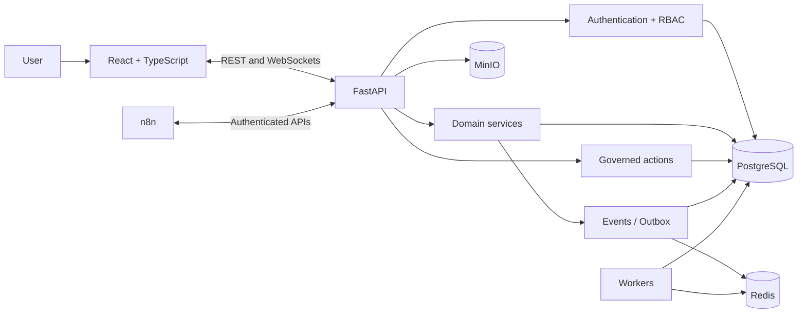

<div align="center">

# Portal — public reference for an earlier architecture

### Modular platform for operations, approvals, integrations and automation

[](https://github.com/Mayconxzdev/Portal/actions/workflows/ci.yml)
[](https://github.com/Mayconxzdev/Portal/actions/workflows/codeql.yml)


[Architecture](docs/ARCHITECTURE.md) · [Module status](docs/PROJECT_STATUS.md) · [Security](docs/SECURITY.md) · [Português](README.md)

</div>

## About this repository

This repository preserves a **sanitized public reference of an earlier Portal version**. I built it to bring together processes that were spread across spreadsheets, email, internal systems and isolated automations.

The current product continues in a private repository with a multi-tenant direction and major foundation changes. It is still under development and is being technically revalidated before an internal pilot. This public code should therefore be read as architecture history and a record of decisions I explored, not as the complete current product.

## The problem I worked on

A single business operation often crosses several places:

- a request starts in a conversation or email;
- data lives in separate spreadsheets and systems;
- approval happens outside the workflow;
- execution is tracked somewhere else;
- history becomes fragmented;
- automations begin to hold rules that should belong to the main product.

I designed Portal around connected journeys, domain ownership, governed actions and contract-based integrations.

## What I built in this reference

- React and TypeScript interface with reusable components and design tokens;
- FastAPI backend with domain-specific models, services, schemas and routes;
- PostgreSQL and Alembic migrations;
- authentication, RBAC, auditing and server-side validation;
- WebSocket-based real-time communication;
- internal events and transactional outbox;
- n8n integrations through APIs and signed callbacks, without using workflows as the primary data source;
- modules for procurement, inventory, approvals, production, IT, communication and automation;
- automated tests, linting, builds, CI and CodeQL.

## Public-version interface

The screens use synthetic data and show the visual direction of the earlier architecture.

| Dashboard | Production |
|---|---|
|  |  |

| Procurement | Inventory |
|---|---|
|  |  |

| IT and HelpDesk | Approvals |
|---|---|
|  |  |

| Chat and assistant |
|---|
|  |

## Architecture

This version uses a **modular monolith**: one backend application with domains separated through their own modules, models, services, schemas and routes.



### Main decisions

| Decision | Reason |
|---|---|
| Modular monolith | Preserve domain boundaries without taking on microservice complexity too early. |
| PostgreSQL as the primary source | Avoid conflicting state across modules, spreadsheets and automations. |
| Governed actions | Separate intent, validation, confirmation and sensitive execution. |
| Transactional outbox | Store state and its event in the same transaction. |
| n8n through APIs | Keep rules and permissions in the product while using automations as executors. |
| Encrypted vault | Protect secrets at rest and audit relevant access. |

## Stack

| Layer | Technologies |
|---|---|
| Frontend | React 19, TypeScript, Vite, CSS, Lucide, dnd-kit |
| Backend | Python, FastAPI, Pydantic, SQLAlchemy 2.0 |
| Database and migrations | PostgreSQL, Alembic |
| Events and jobs | Redis, Dramatiq, WebSockets |
| Files | MinIO / S3-compatible storage |
| Automation | n8n, webhooks and signed callbacks |
| Desktop | Tauri 2 |
| Quality | Pytest, Vitest, Testing Library, ESLint, Ruff, CodeQL |
| Local infrastructure | Docker Compose, Adminer, SearXNG |

## Run locally

### Requirements

- Docker with Compose;
- Node.js 24;
- Python 3.14;
- Git.

### Windows

```bat
copy .env.example .env
INICIAR_PORTAL.bat
```

### Linux or macOS

```bash
cp .env.example .env
./scripts/dev.sh
```

After the local seed:

- Portal: `http://localhost:5173`
- API: `http://localhost:8000/docs`
- development user: `vesper_admin`
- development password: `portal-dev-only`

These credentials exist only for the local demonstration environment and must be changed before any shared use.

## Current limits

- this repository is not the complete current private foundation;
- its screens and modules belong to an earlier public reference;
- some flows in this version are more mature than others;
- presence in the source does not mean production deployment or approval;
- the current product remains under development and revalidation before a pilot;
- company data, credentials, files and infrastructure are not part of this publication.

## Author

**Maycon Ferreira** — product, architecture, backend, frontend, integrations, automation, tests and documentation.

## License

Distributed under the [MIT license](LICENSE).
