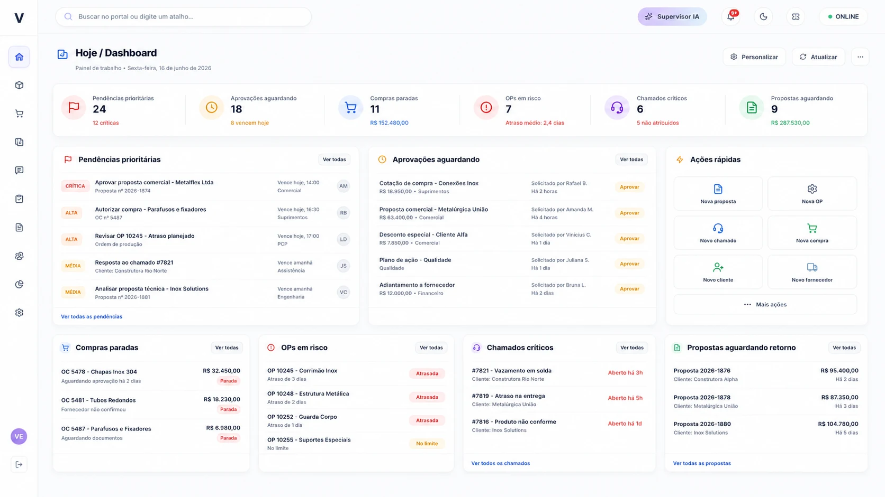
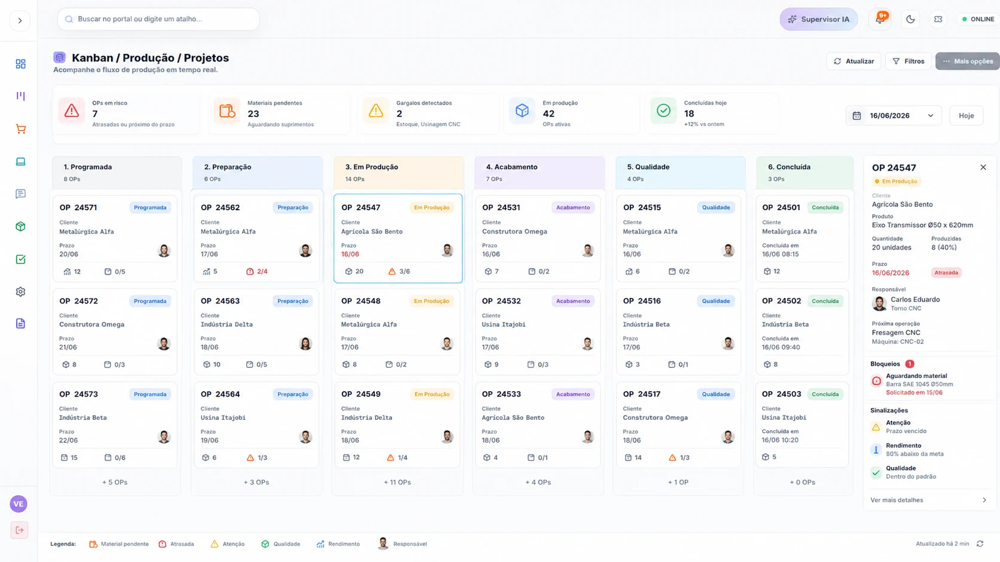
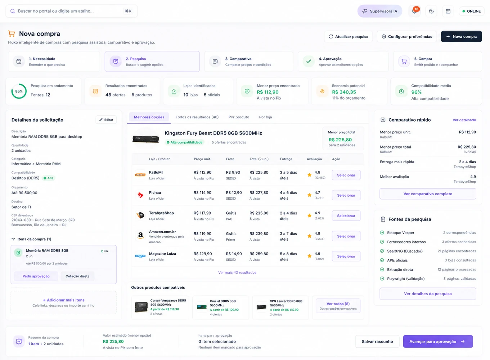
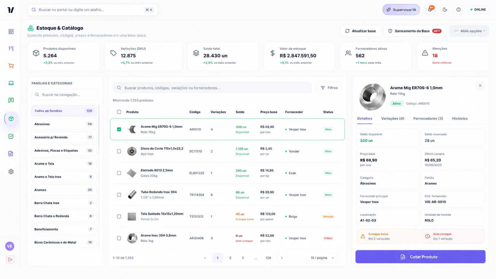
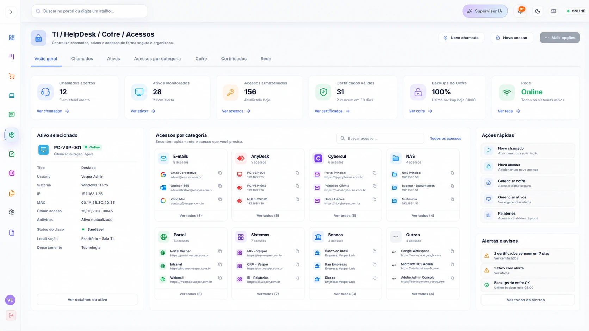
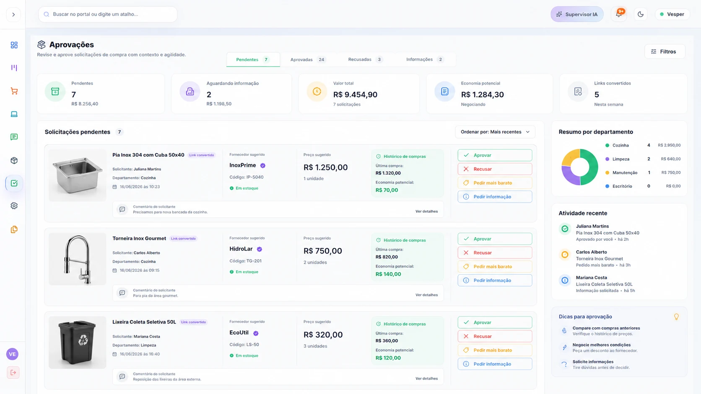
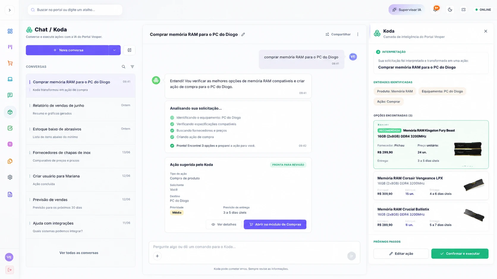
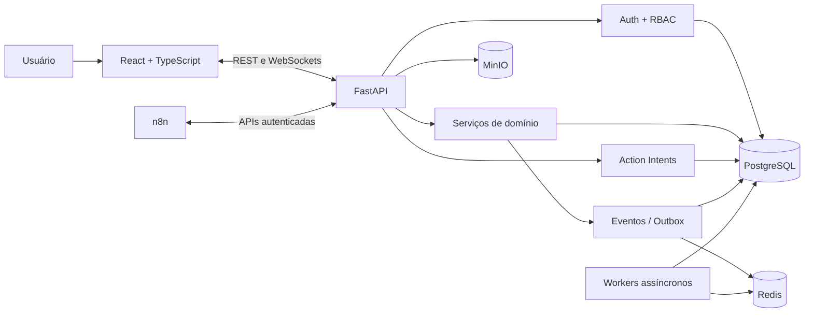

<div align="center">

# Portal Vesper

### Plataforma corporativa modular para operações, governança e automações

[](https://github.com/Mayconxzdev/Portal/actions/workflows/ci.yml)
[](https://github.com/Mayconxzdev/Portal/actions/workflows/codeql.yml)


[Case de produto](docs/PORTFOLIO_CASE_STUDY.md) ·
[Arquitetura](docs/ARCHITECTURE.md) ·
[Estado dos módulos](docs/PROJECT_STATUS.md) ·
[English version](README.en.md)

</div>

---

## Visão geral

O **Portal Vesper** é uma plataforma interna que centraliza processos normalmente dispersos entre planilhas, e-mails, sistemas legados e ferramentas isoladas. O projeto reúne operações de compras, estoque, aprovações, produção, TI, comunicação e automações dentro de uma arquitetura modular, auditável e orientada a eventos.

O objetivo não é apenas colocar vários módulos no mesmo menu. A proposta é criar **jornadas conectadas**, nas quais cada domínio mantém sua responsabilidade e compartilha eventos e ações governadas com o restante da plataforma.

### O que este projeto demonstra

- modelagem de produto para um domínio corporativo amplo;
- frontend React/TypeScript com componentes reutilizáveis e design tokens;
- APIs FastAPI com autenticação, RBAC, auditoria e migrações;
- PostgreSQL como fonte principal de dados;
- comunicação em tempo real com WebSockets;
- eventos internos, outbox e reações assíncronas;
- automações n8n tratadas como executoras, não como fonte da verdade;
- testes automatizados, lint, build, CI e análise de segurança.

> **Escopo do repositório:** implementação de portfólio e referência técnica. Alguns módulos estão operacionais, outros possuem maturidade parcial ou fluxo demonstrativo. O estado de cada área está documentado sem promessas de produção em [`docs/PROJECT_STATUS.md`](docs/PROJECT_STATUS.md).

### Origem e estado real deste case

Este repositório público foi montado especificamente como uma **referência arquitetural sanitizada** do estado atual do Portal Vesper e dos sistemas internos que estão sendo consolidados nele.

O desenvolvimento original ocorreu em ambiente privado. Por esse motivo, o histórico público começa em uma publicação concentrada e não representa o histórico completo de construção, testes, decisões e evolução do produto.

Todos os módulos presentes no código correspondem a áreas já utilizadas internamente, porém com níveis diferentes de maturidade. “Presente no código” não significa que toda funcionalidade esteja igualmente homologada para produção. O estado de cada área deve ser analisado junto com [`docs/PROJECT_STATUS.md`](docs/PROJECT_STATUS.md).

## Resumo para avaliação técnica

| Item | Evidência no repositório |
|---|---|
| Produto | Jornadas conectadas de compras, estoque, aprovações, produção, TI e comunicação |
| Arquitetura | Monólito modular, contratos de domínio, Action Intents e transactional outbox |
| Backend | 19 domínios em FastAPI/SQLAlchemy e 51 migrações Alembic |
| Frontend | React/TypeScript, design tokens, acessibilidade e interfaces orientadas a tarefas |
| Qualidade | 46 arquivos de testes automatizados, lint estrito, build, CI e CodeQL |
| Automação | 22 templates n8n públicos, desativados e sem credenciais |
| Segurança | RBAC, auditoria, validação server-side, callbacks assinados e cofre cifrado |

Os números acima descrevem o **inventário do código**, não um resultado de testes. O estado de execução deve ser confirmado pelo workflow de CI da versão publicada.

### Caminho de revisão em cinco minutos

1. Veja as [telas e jornadas](#interface-e-jornadas).
2. Leia o [case de produto](docs/PORTFOLIO_CASE_STUDY.md).
3. Confira as [decisões arquiteturais](docs/ARCHITECTURE_DECISIONS.md).
4. Consulte a [maturidade e as limitações](docs/PROJECT_STATUS.md).
5. Explore os pontos de entrada: [`backend/app/main.py`](backend/app/main.py), [`backend/app/modules/`](backend/app/modules/) e [`apps/web/src/`](apps/web/src/).

### Atuação apresentada neste case

O repositório reúne concepção de produto, arquitetura de soluções, automações, integrações, backend, frontend operacional, testes, documentação e preparação de entrega. Ferramentas de IA foram utilizadas como apoio de pesquisa, implementação, revisão e validação; as regras de negócio, riscos, limitações e critérios de qualidade permanecem explícitos e verificáveis no código.

---

## Interface e jornadas

As telas abaixo usam **dados sintéticos de demonstração**. Elas apresentam a direção visual e os fluxos representativos do produto sem expor informações operacionais reais.

### Dashboard orientado a ação



O dashboard consolida pendências, riscos, aprovações e atalhos sem assumir a responsabilidade dos módulos de origem.

<table>
<tr>
<td width="50%">

### Kanban e execução operacional



</td>
<td width="50%">

### Compras e cotações



</td>
</tr>
<tr>
<td width="50%">

### Estoque e catálogo



</td>
<td width="50%">

### TI, Help Desk e ativos



</td>
</tr>
<tr>
<td width="50%">

### Aprovações e governança



</td>
<td width="50%">

### Chat e assistente operacional



</td>
</tr>
</table>

---

## Problema de produto

Em ambientes corporativos, uma mesma operação costuma atravessar vários canais:

- a necessidade nasce em uma conversa ou e-mail;
- o item é pesquisado em planilhas ou catálogos separados;
- a aprovação acontece fora do sistema;
- a execução é acompanhada em outro quadro;
- o histórico fica fragmentado;
- automações externas passam a concentrar regras que deveriam pertencer ao produto.

O Portal organiza esse cenário a partir de três princípios:

1. **Responsabilidade por domínio:** cada módulo é dono apenas das regras e entidades que lhe pertencem.
2. **Ações governadas:** operações sensíveis passam por permissão, preview, confirmação ou aprovação.
3. **Integração por contratos:** eventos, APIs e Action Intents conectam os módulos sem acesso direto ao banco por ferramentas externas.

---

## Jornadas principais

### Compra de item conhecido

Estoque identifica a necessidade → Compras recupera item e histórico → fornecedores e opções são comparados → Aprovações registra a decisão → Compras acompanha pedido e entrega → Estoque recebe preço e rastreabilidade.

### Ordem de produção bloqueada

Kanban registra o bloqueio → Estoque verifica saldo → Compras abre a necessidade → Aprovações atua quando necessário → a entrega remove o bloqueio → Dashboard e BI recebem eventos do processo.

### Suporte e ativos de TI

Usuário abre chamado → SLA e prioridade são calculados → equipe técnica relaciona ativo, acesso, certificado ou credencial → atividades e revelações sensíveis ficam auditadas.

### Ação solicitada pelo chat ou Koda

A conversa identifica a intenção → o Portal cria um rascunho de ação → o módulo de destino valida permissões e dados → ações de risco exigem confirmação ou aprovação → o resultado volta para a conversa e para a auditoria.

---

## Arquitetura

O projeto adota um **monólito modular**: existe uma única aplicação backend, mas os domínios são separados por módulos, modelos, serviços, schemas e rotas próprias.



### Decisões de engenharia

| Decisão | Motivo |
|---|---|
| Monólito modular | Preserva fronteiras de domínio sem introduzir a complexidade operacional prematura de microserviços. |
| PostgreSQL como fonte da verdade | Evita duplicidade entre módulos, planilhas e automações. |
| Action Intents | Separa interpretação da execução e cria uma etapa explícita de governança. |
| Transactional outbox | Mantém a gravação do estado e do evento na mesma transação. |
| n8n apenas via API | Impede que workflows externos contornem validações e permissões. |
| Cofre com Fernet | Mantém segredos cifrados em repouso e auditados no momento da revelação. |
| CSS com design tokens | Mantém consistência visual sem acoplar a interface a uma biblioteca de componentes externa. |

Mais detalhes em [`docs/ARCHITECTURE_DECISIONS.md`](docs/ARCHITECTURE_DECISIONS.md).

---

## Módulos

| Área | Responsabilidade | Maturidade resumida |
|---|---|---|
| Administração | Usuários, perfis, permissões, sessões e ciclo de vida | Base avançada |
| Kanban | Quadros, cards, listas, campos, permissões e modo TV | Base avançada |
| TI | Chamados, ativos, certificados, manutenção, rede e cofre | Base avançada |
| Chat / Koda | Conversas, menções, anexos, threads e ações assistidas | Base funcional |
| Aprovações | Decisões humanas, comentários, opções e histórico | Base funcional |
| Estoque | Catálogo, classificação, importação, ofertas e histórico | Avançado |
| Compras | Necessidades, pesquisa, RFQ, respostas, comparação e entrega | Parcial avançado |
| Dashboard | Consolidação de pendências e ações por perfil | Parcial |
| Propostas | Fluxo comercial e documentos | Protótipo |
| Arquivos / Knowledge | Upload, busca e vínculo contextual | Parcial |
| Automações / n8n | Templates e callbacks controlados | Parcial |

A matriz completa, incluindo limitações e próximos passos, está em [`docs/PROJECT_STATUS.md`](docs/PROJECT_STATUS.md).

---

## Segurança e governança

- senhas armazenadas com bcrypt;
- autenticação JWT e sessão por cookie;
- RBAC e permissões validadas no backend;
- rate limit no fluxo de autenticação;
- headers de segurança e CSP configuráveis;
- segredos do módulo de TI cifrados com Fernet;
- logs de auditoria para operações relevantes;
- callbacks n8n com assinatura, janela de tempo e proteção contra replay;
- uploads e anexos submetidos a validação e sanitização;
- dados locais, `.env` e uploads operacionais excluídos do repositório.

Consulte [`SECURITY.md`](SECURITY.md) e [`docs/SECURITY.md`](docs/SECURITY.md).

---

## Stack

| Camada | Tecnologias |
|---|---|
| Frontend | React 19, TypeScript, Vite, CSS, Lucide, dnd-kit |
| Backend | Python, FastAPI, Pydantic, SQLAlchemy 2.0 |
| Banco e migrações | PostgreSQL, Alembic |
| Eventos e jobs | Redis, Dramatiq, WebSockets |
| Arquivos | MinIO / S3-compatible storage |
| Automação | n8n, webhooks e callbacks assinados |
| Desktop | Tauri 2 |
| Qualidade | Pytest, Vitest, Testing Library, ESLint, Ruff, CodeQL |
| Infra local | Docker Compose, Adminer, SearXNG |

---

## Estrutura do repositório

```text
.
├── apps/
│   ├── web/                  # React + TypeScript
│   └── desktop/              # Shell Tauri
├── backend/
│   ├── app/                  # API, domínios, modelos e serviços
│   ├── alembic/              # Migrações
│   └── tests/                # Testes do backend
├── docs/                     # Arquitetura, produto, segurança e módulos
├── infra/                    # Docker Compose e serviços locais
├── n8n/workflows/            # Templates públicos sanitizados
├── scripts/                  # Setup, seed, QA e importadores
└── storage/uploads/.gitkeep  # Uploads reais nunca são versionados
```

---

## Executando localmente

### Requisitos

- Docker Desktop ou Docker Engine com Compose;
- Node.js 24;
- Python 3.14;
- Git.

### Windows

```bat
copy .env.example .env
INICIAR_PORTAL.bat
```

### Linux ou macOS

```bash
cp .env.example .env
./scripts/dev.sh
```

Após o seed local:

- Portal: `http://localhost:5173`
- API / Swagger: `http://localhost:8000/docs`
- usuário de desenvolvimento: `vesper_admin`
- senha de desenvolvimento: `portal-dev-only`

> Essas credenciais existem somente para o ambiente local. Troque todos os valores `local-dev-*` do `.env` antes de qualquer ambiente compartilhado.

Guia detalhado: [`PORTAL_STARTUP_GUIDE.md`](PORTAL_STARTUP_GUIDE.md).

---

## Qualidade

### Backend

```bash
cd backend
pip install -r requirements-dev.txt
ruff check app tests
python -m compileall -q app alembic
ENVIRONMENT=testing PYTHONPATH=. pytest -q
```

### Frontend

```bash
cd apps/web
npm ci
npm run lint
npm run test:run
npm run build
```

### Verificação completa em Unix

```bash
./scripts/check.sh
```

O workflow [`Portal CI`](.github/workflows/ci.yml) executa lint, compilação, testes e build em cada pull request. O workflow [`CodeQL`](.github/workflows/codeql.yml) analisa Python e JavaScript/TypeScript.

---

## Documentação

- [Case de produto e engenharia](docs/PORTFOLIO_CASE_STUDY.md)
- [Estado atual e limitações](docs/PROJECT_STATUS.md)
- [Arquitetura canônica](docs/ARCHITECTURE.md)
- [Decisões arquiteturais](docs/ARCHITECTURE_DECISIONS.md)
- [Modelo de dados](docs/DATABASE.md)
- [Integrações e eventos](docs/INTEGRATIONS_AND_EVENTS.md)
- [Segurança](docs/SECURITY.md)
- [Padrões de UX](docs/UX_STANDARDS.md)
- [Mapa dos módulos](docs/MODULE_MAP.md)
- [Templates n8n](n8n/README.md)

---

## Limitações conhecidas

- não há uma demonstração pública hospedada neste repositório;
- integrações externas dependem de credenciais e infraestrutura próprias;
- envio real de e-mail, conectores comerciais e automações operacionais precisam de ambiente de homologação;
- Propostas, BI, Monitoramento e Knowledge ainda não possuem a mesma maturidade dos módulos centrais;
- os templates n8n são publicados desativados e sem credenciais;
- esta distribuição não contém uploads, banco, arquivos legados ou dados de empresa.

Essas limitações são intencionais e estão registradas para evitar que uma demonstração de portfólio seja apresentada como implantação de produção.

---

## Autor

**Maycon da Silva Ferreira**

- GitHub: [@Mayconxzdev](https://github.com/Mayconxzdev)
- E-mail: [mayconxz00dev@gmail.com](mailto:mayconxz00dev@gmail.com)

## Licença

O código é disponibilizado sob a licença [MIT](LICENSE). Marcas, dados empresariais e integrações de terceiros permanecem sujeitos aos respectivos direitos e termos.
