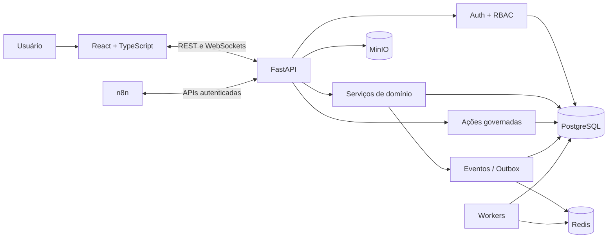

<div align="center">

# Portal — referência pública da arquitetura anterior

### Plataforma modular para operações, aprovações, integrações e automações

[](https://github.com/Mayconxzdev/Portal/actions/workflows/ci.yml)
[](https://github.com/Mayconxzdev/Portal/actions/workflows/codeql.yml)


[Arquitetura](docs/ARCHITECTURE.md) · [Estado dos módulos](docs/PROJECT_STATUS.md) · [Segurança](docs/SECURITY.md) · [English](README.en.md)

</div>

## Sobre este repositório

Este repositório preserva uma **referência pública e sanitizada de uma versão anterior do Portal**. Eu o desenvolvi para centralizar processos que normalmente ficam distribuídos entre planilhas, e-mails, sistemas internos e automações isoladas.

A versão atual do produto segue em um repositório privado, com direção multiempresa e mudanças importantes na fundação. Ela ainda está em desenvolvimento e passa por revalidação técnica antes de um piloto interno. Por isso, o código desta publicação deve ser entendido como histórico arquitetural e demonstração das decisões que já explorei, e não como o estado atual completo do produto.

## Problema que trabalhei

Uma mesma operação empresarial costuma atravessar vários lugares:

- a necessidade nasce em uma conversa ou e-mail;
- dados ficam em planilhas e sistemas separados;
- a aprovação acontece fora do fluxo;
- a execução é acompanhada em outra ferramenta;
- o histórico fica fragmentado;
- automações passam a concentrar regras que deveriam pertencer ao sistema principal.

O Portal foi pensado para conectar essas jornadas mantendo responsabilidade por domínio, ações governadas e integrações por contratos.

## O que desenvolvi nesta referência

- interface React e TypeScript com componentes reutilizáveis e design tokens;
- backend FastAPI com modelos, serviços, schemas e rotas por domínio;
- PostgreSQL e migrações Alembic;
- autenticação, RBAC, auditoria e validações no servidor;
- comunicação em tempo real com WebSockets;
- eventos internos e transactional outbox;
- integrações n8n por APIs e callbacks, sem transformar workflows em fonte principal de dados;
- módulos para compras, estoque, aprovações, produção, TI, comunicação e automações;
- testes, lint, build, CI e análise com CodeQL.

## Interface da versão pública

As telas utilizam dados sintéticos e mostram a direção visual da arquitetura anterior.

| Dashboard | Produção |
|---|---|
|  |  |

| Compras | Estoque |
|---|---|
|  |  |

| TI e HelpDesk | Aprovações |
|---|---|
|  |  |

| Chat e assistente |
|---|
|  |

## Arquitetura

Esta versão usa um **monólito modular**: uma aplicação backend, com domínios separados por módulos, modelos, serviços, schemas e rotas.



### Decisões principais

| Decisão | Motivo |
|---|---|
| Monólito modular | Manter fronteiras de domínio sem assumir cedo a complexidade de microserviços. |
| PostgreSQL como fonte principal | Evitar que planilhas, módulos e automações mantenham estados conflitantes. |
| Ações governadas | Separar intenção, validação, confirmação e execução de operações sensíveis. |
| Transactional outbox | Gravar o estado e o evento na mesma transação. |
| n8n por API | Manter regras e permissões no produto, usando automações como executoras. |
| Cofre cifrado | Proteger segredos em repouso e registrar acessos relevantes. |

## Stack

| Camada | Tecnologias |
|---|---|
| Frontend | React 19, TypeScript, Vite, CSS, Lucide, dnd-kit |
| Backend | Python, FastAPI, Pydantic, SQLAlchemy 2.0 |
| Banco e migrações | PostgreSQL, Alembic |
| Eventos e jobs | Redis, Dramatiq, WebSockets |
| Arquivos | MinIO / armazenamento compatível com S3 |
| Automação | n8n, webhooks e callbacks assinados |
| Desktop | Tauri 2 |
| Qualidade | Pytest, Vitest, Testing Library, ESLint, Ruff, CodeQL |
| Infra local | Docker Compose, Adminer, SearXNG |

## Executar localmente

### Requisitos

- Docker com Compose;
- Node.js 24;
- Python 3.14;
- Git.

### Windows

```bat
copy .env.example .env
INICIAR_PORTAL.bat
```

### Linux ou macOS

```bash
cp .env.example .env
./scripts/dev.sh
```

Depois do seed local:

- Portal: `http://localhost:5173`
- API: `http://localhost:8000/docs`
- usuário de desenvolvimento: `vesper_admin`
- senha de desenvolvimento: `portal-dev-only`

As credenciais acima existem somente no ambiente local de demonstração e devem ser alteradas antes de qualquer uso compartilhado.

## Estado e limites

- este repositório não representa a fundação privada atual completa;
- as telas e os módulos pertencem a uma referência pública anterior;
- alguns fluxos desta versão estão mais maduros que outros;
- presença no código não significa implantação ou homologação em produção;
- o produto atual ainda passa por desenvolvimento e revalidação antes do piloto;
- dados, credenciais, arquivos e infraestrutura empresariais não fazem parte desta publicação.

## Autor

**Maycon Ferreira** — produto, arquitetura, backend, frontend, integrações, automações, testes e documentação.

## Licença

Distribuído sob a [licença MIT](LICENSE).
