# Galeria Visual dos Módulos

> Imagens conceituais em tema claro. Use para composição e hierarquia, nunca como prova de funcionalidade ou fonte de dados.

## Dashboard / Hoje

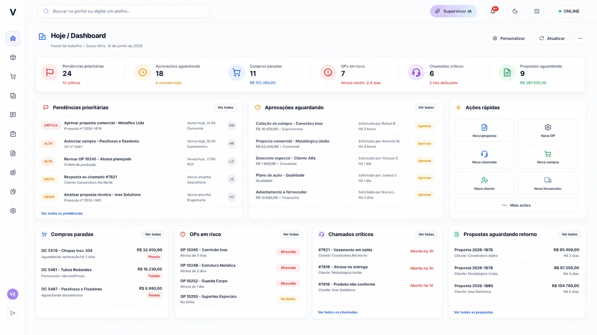

## Administração

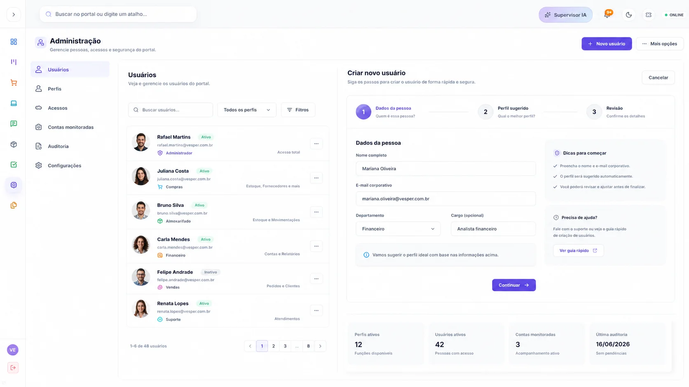

## Estoque & Catálogo

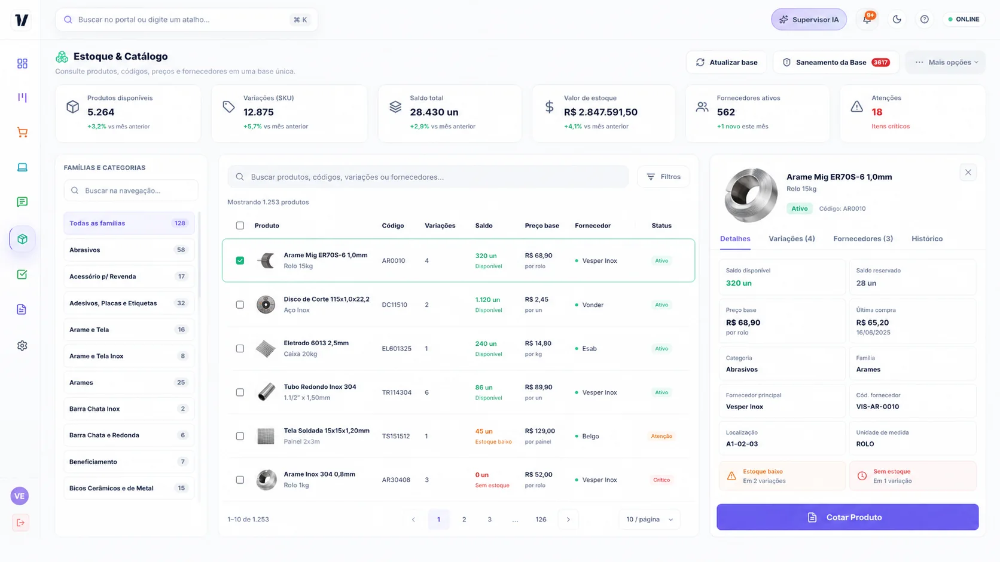

## Compras

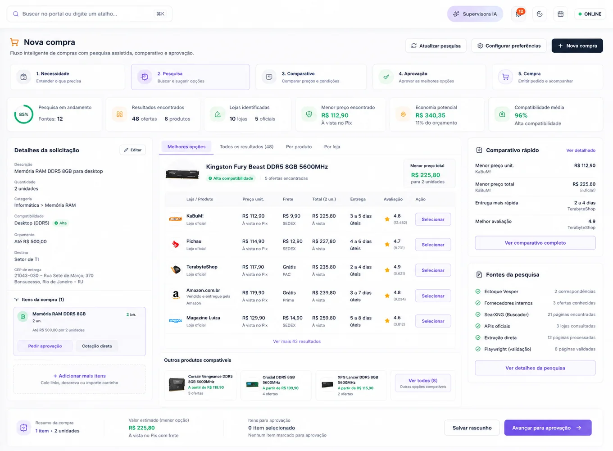

## Aprovações

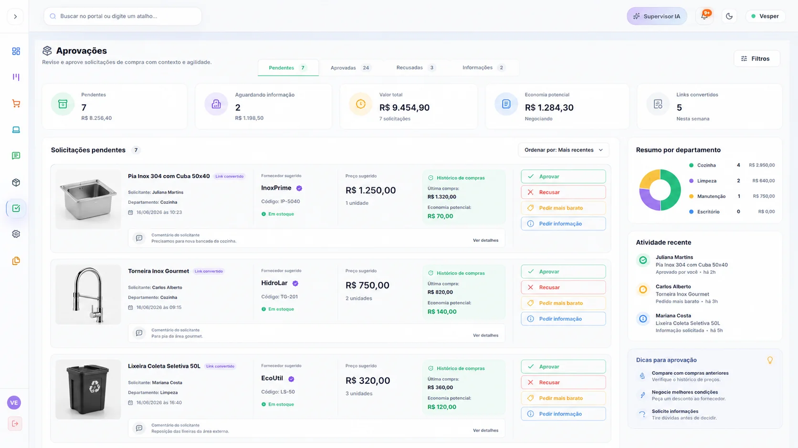

## Propostas

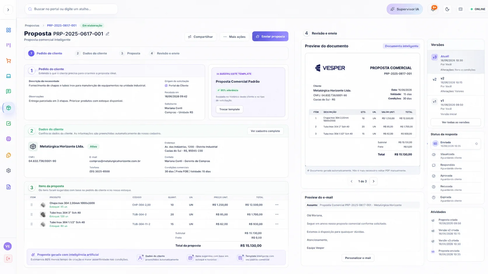

## Kanban / Produção / Projetos

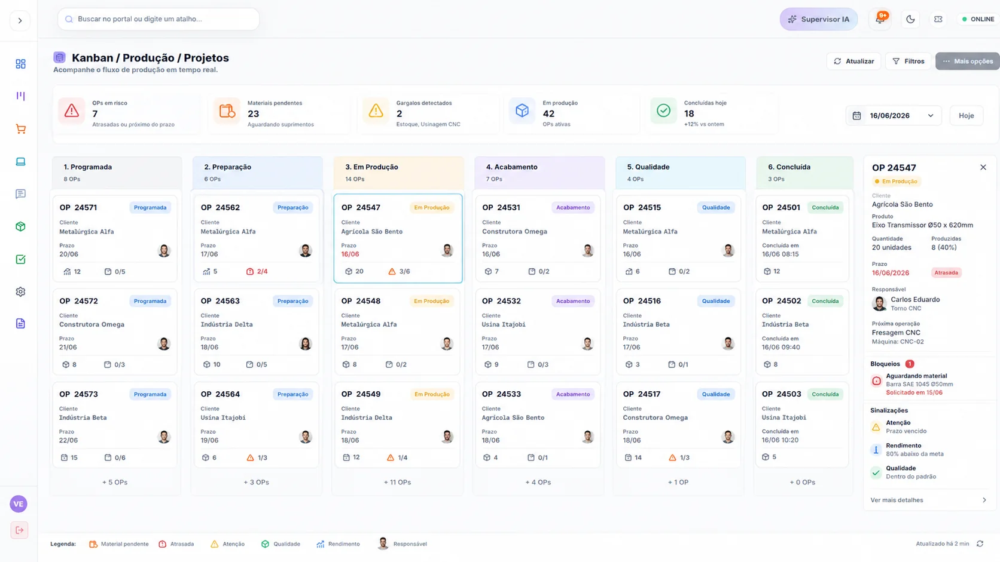

## TI / HelpDesk / Cofre / Acessos

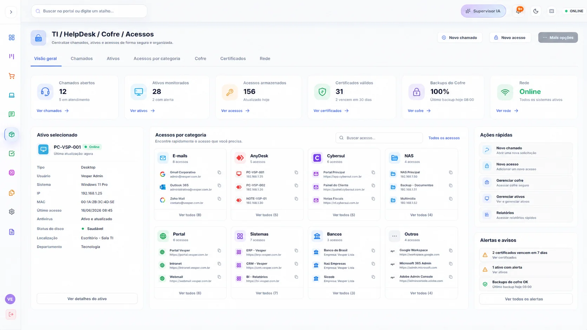

## Knowledge / Arquivos

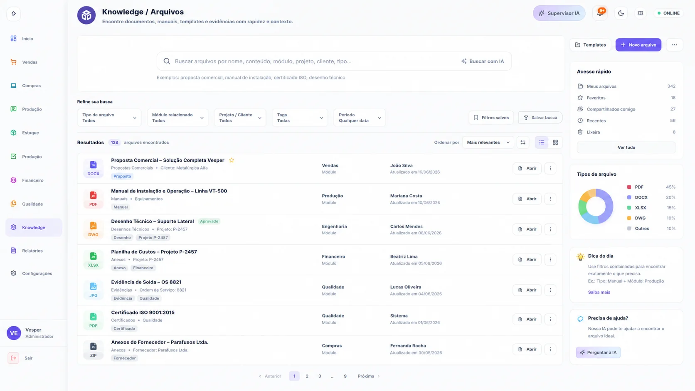

## Chat / Koda

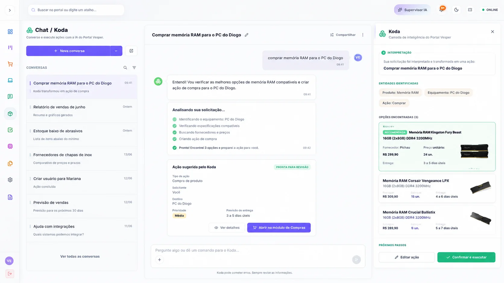

## Central de Monitoramento

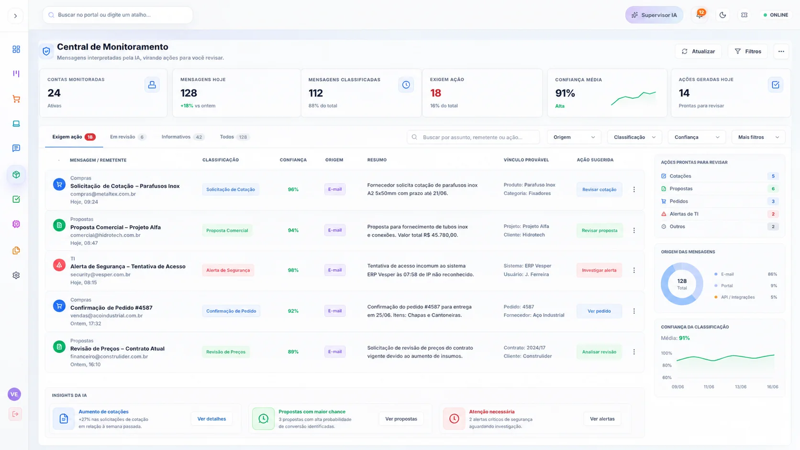

## Automações / n8n

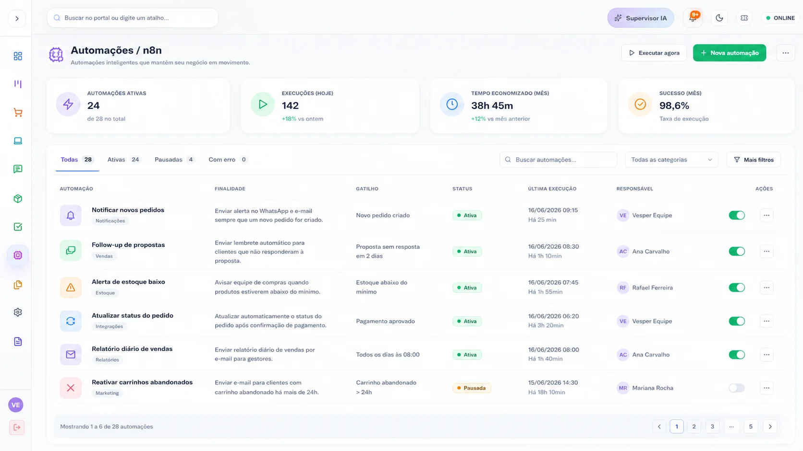

## BI / Relatórios

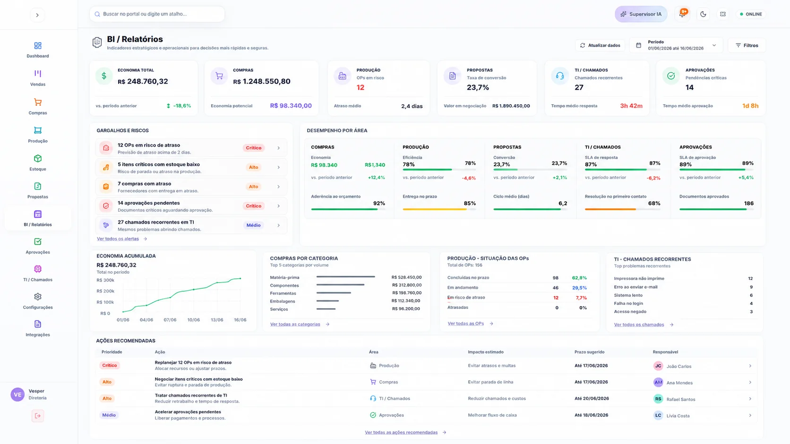
